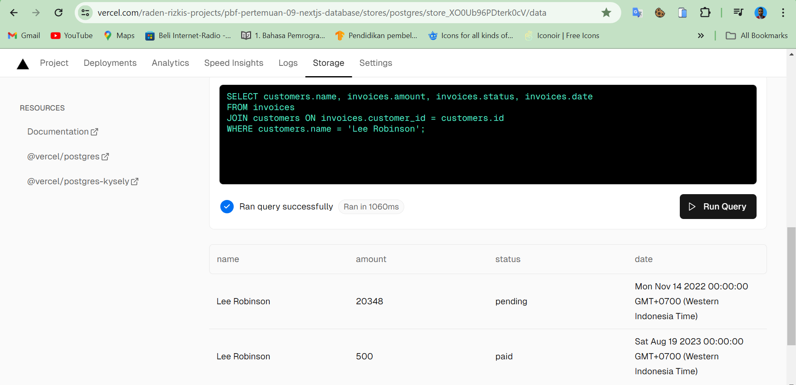

| Raden Rizki | 2141720064 | TI - 3C | 13 |

## Praktikum 1: Setup Database

### Langkah 1: Buat Project Baru dengan [Template](https://github.com/jti-polinema/09-nextjs-database)


### Langkah 2: Membuat Akun [Vercel](https://vercel.com/signup)


- Klik Continue with GitHub


### Langkah 3: Koneksikan dan Deploy Project Anda

- Klik Install > Pilih Repo > Install


- Klik Import > Pilih Framework > Deploy


**Soal 1**

Capture hasil deploy project Anda dan buatlah laporan di file README.md. Jelaskan apa yang telah Anda pelajari?

Dengan memanfaatkan Vercel, deployment proyek dapat dilakukan dengan mengimport ada memberi akses Vercel, baik ke semua repository yang dimiliki atau hanya yand dipilih saja. Selain itu, Vercel juga menyediakan preview dari laman yang sudah dibuat.

### Langkah 4: Membuat Basis Data Postgres


Show secret > Copy Snippet


Install Vercel Postgres SDK

```bash
npm i --save @vercel/postgres
```

**Soal 2**

Capture hasil basis data Anda dan buatlah laporan di file README.md. Jelaskan apa yang telah Anda pelajari?

Selain dalam hal deployment proyek dari Github, Vercel juga dapat membantu dalam pembuatan Database, pada praktikum ini dilakukan pembuatan database Postgre dengan Vercel, untuk mengakses Database ini maka perlu dibuat file .env dan menambahkan file tersebut ke .gitignore agar kode untuk akses database tersebut tidak ikut terpush ke Github.

### Langkah 5: Melakukan seed ke basis data


```bash
 "seed": "node -r dotenv/config ./src/seeder/seed.js"
```


```bash
npm run seed
```

Error: Cannot find module 'dotenv/config'

```bash
npm i --save dotenv
```

Error: Cannot find module 'data.js'


Error: Cannot find module 'bcrypt'

```bash
npm i --save bcrypt
```


**Soal 3**

Capture hasil npm run seed Anda dan buatlah laporan di file README.md. Jelaskan apa yang telah Anda pelajari ?

Dari file yand sudah dibuat tersebut, masing-masing memiliki kegunaan. File seed.js berguna untuk menginputkan data dan tabel kedalam database, sedangkan data.js berguna untuk menentukan data apa saja yang akan diinputkan ditiap tabel.

### Langkah 6: Menjelajah Basis Data


```bash
SELECT invoices.amount, customers.name
FROM invoices
JOIN customers ON invoices.customer_id = customers.id
WHERE invoices.amount = 666;
```


Soal 4
Capture hasil query Anda dan buatlah laporan di file README.md. Jelaskan apa yang telah Anda pelajari ? 

Dari Query diatas berguna untuk menggabungkan tabel invoices dan customers, dengan hanya menampilkan data amount dan name dari masing-masing tabel dengan key berupa customer_id, dan data yang ditampilkan adalah amount dari invoices yang memiliki nilai 666.

Cobalah eksekusi query SQL yang lain sesuai kreasi Anda, capture hasilnya dan jelaskan!



```bash
SELECT customers.name, invoices.amount, invoices.status, invoices.date
FROM invoices
JOIN customers ON invoices.customer_id = customers.id
WHERE customers.name = 'Lee Robinson';
```

Masih sama seperti sebelumnya yaitu menggabungkan tabel invoices dan customers berdasarkan customer_id, namun data yang ditampilkan adalah dari kolom customers.name, invoices.amount, invoices.status, dan invoices.date yang memiliki customers.name Lee Robinson.

## Praktikum 2: Fetching Data (API)

### Langkah 1: Membuat Global Query (Model)


### Langkah 2: Membuat Komponen Atom


```bash
npm i --save @heroicons/react

npm i --save clsx
```


Soal 5
Lakukan push, kemudian perhatikan di akun dashboard Vercel project Anda. Capture dan lampirkan link aplikasi Anda yang telah berhasil di deploy, kemudian buatlah laporan di file README.md. Jelaskan apa yang telah Anda pelajari ?


[Link App](https://pbf-pertemuan-09-nextjs-database.vercel.app/)

Pertama-tama dilakukan pembuatan model definitions yang berguna untuk menentukan struktur data dari setiap model atau tabel yang dibuat. Selanjutnya model query disini dapat membantu dalam memperoleh data dari database dengan berbagai query yang dibutuhkan, selain itu, pada model query ini juga dapat mengolah data yang didapat sebelum dikirimkan ke laman atau client.

Dan pada components mulai dibuat komponen dan laman yang akan ditampilkan, beserta data yang didapatkan, namun saat ini laman yang berguna untuk menampilkan data masih belum dijalankan, untuk mencegah terjadinya error. Setelah components selesai, selanjutnya adalah memperbarui halaman page.tsx yang merupakan tampilan utama, sehingga components yang sudah dibuat dapat diimport dan disajikan di halaman website saat server dijalankan.

### Langkah 3: Fetching Data untuk komponen RevenueChart


**Soal 6**
Lakukan capture dan push hasilnya, kemudian buatlah laporan di file README.md. Jelaskan apa yang telah Anda pelajari ?

Data yang diperoleh dari revenueFetch diolah untuk ditampilkan dalam laman ReactJS, dengan dimulai dari mengekstrak data untuk sumbu X dan Y. Selanjutnya data revenue dikonversi ke format data map, dan terakhir adalah menampilkan data dari map revenue tersebut.

### Langkah 4: Fetching Data untuk komponen LatestInvoices


**Soal 7**
Lakukan capture dan push hasilnya, kemudian buatlah laporan di file README.md. Jelaskan apa yang telah Anda pelajari ?

Dengan mengakses model query untuk memperoleh 5 data terbaru pada function fetchLatestInvoices, limitasi dilakukan dengan menambahkan LIMIT 5 pada query data. Data disimpan pada latestInvoices yang selanjutnya di ekstrak ke map dan ditampilkan pada laman.

## Tugas Praktikum


Pada function fetchCardData, query bertujuan untuk mengambil total banyak data pada invoices dan customers, serta total banyak data untuk invoices dengan status paid dan pending. Dari hasil query tersebut datanya diekstrak menjadi data number yang selanjutnya 4 data tersebut akan direturn.